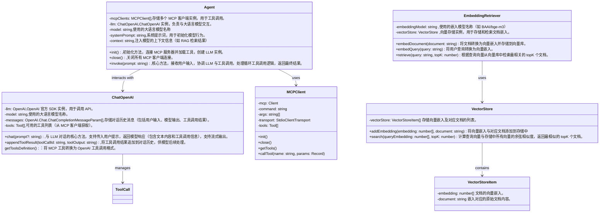

# ArgoAgent

<div align="center">
  
  <h1 align="center">ArgoAgent</h1>
  <h2 align="center">A vessel not of wood, but of discovery</h2>

</div>
<div align="center">
<!-- Keep these links. Translations will automatically update with the README. -->
  
[Deutsch](https://zdoc.app/de/BV003/ArgoAgent) | 
[English](https://zdoc.app/en/BV003/ArgoAgent) | 
[Español](https://zdoc.app/es/BV003/ArgoAgent) | 
[français](https://zdoc.app/fr/BV003/ArgoAgent) | 
[日本語](https://zdoc.app/ja/BV003/ArgoAgent) | 
[한국어](https://zdoc.app/ko/BV003/ArgoAgent) | 
[Português](https://zdoc.app/pt/BV003/ArgoAgent) | 
[Русский](https://zdoc.app/ru/BV003/ArgoAgent) | 
[中文](https://zdoc.app/zh/BV003/ArgoAgent)

</div>


### 🚀 Introduction
核心目标是构建一个通用的 agent 包，让开发者能方便地创建和扩展智能代理


### ✨ Features
#### Intelligent Interaction with Context Preservation
Automatically determines whether to call external tools or generate direct LLM responses based on user instructions, while maintaining context throughout the interaction.


### 🌐 Environment


### 📂 Project Structure

```
├── src
│   ├── argoagent
│   │   ├── __init__.py
│   │   ├── agent
│   │   │   └── agent.py
│   │   ├── cli
│   │   ├── context
│   │   │   └── context.py
│   │   ├── llm
│   │   │   ├── __init__.py
│   │   │   ├── base_llm.py
│   │   │   ├── doubao_llm.py
│   │   │   └── openai_llm.py
│   │   ├── log
│   │   ├── tools
│   │   │   ├── base.py
│   │   │   ├── builtins
│   │   │   │   ├── echo.py
│   │   │   │   └── fetch.py
│   │   │   ├── file
│   │   │   ├── registry.py
│   │   │   └── web
│   │   ├── utils
│   │   └── workflows
│   │       │   
│   │       ├── base.py
│   │       ├── human_in_loop.py
│   │       ├── loop.py
│   │       ├── parallel.py
│   │       ├── router.py
│   │       └── single_step.py

    
```



### ⚡ Quick Start
- 

### 🎯 Core Tech


### 🤝 Contributing

We welcome contributions! Whether it's:

- Bug fixes
- New features
- Documentation improvements
- Translations

Please:  
- Check existing issues first  
- Open an issue to discuss major changes  
- Submit PRs with clear descriptions  


### 🔥 For Beginners

**This is an independent educational project, designed for learning and practice.**

If you are new to open source:
- Don’t worry! This project is meant to be beginner-friendly 
- You can start small (update README, add comments, fix small bugs) 
- You can build on top of this project, customize it, and even use it as part of your course assignments or personal practice projects.🤪


### 🎉 License
This project is licensed under the MIT License - see the [LICENSE](LICENSE) file for details.

### 🙏 Acknowledgments
This project draws inspiration from and builds upon the following projects:
- [mcp-agent](https://github.com/lastmile-ai/mcp-agent) 
- [OpenHands](https://github.com/All-Hands-AI/OpenHands) 
- [llm-mcp-rag](https://github.com/KelvinQiu802/llm-mcp-rag)
- [Building effective agents by Anthropic](https://www.anthropic.com/engineering/building-effective-agents)✅
- [A video about Prompt, Agent, MCP](https://www.bilibili.com/video/BV1aeLqzUE6L/?spm_id_from=333.788.recommend_more_video.0&vd_source=6710a28cdc7d2834e160d5fb90681095)✅
- [MCP SDK(python)](https://github.com/modelcontextprotocol/python-sdk?tab=readme-ov-file#fastmcp-properties)✅